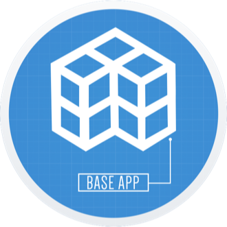

<p align="center">
    
</p>

<p align="center">
    <a href="https://app.bitrise.io/app/650fc8604c9bc611#">
        
    </a>
    <a href="https://codecov.io/gh/silverlogic/BaseApp-iOS">
        
    </a>
    <a href="https://swift.org/">
        
    </a>
</p>

----------------

BaseApp iOS is a template app that has all the necessary features needed for rapid app development.

## Table of Contents

- [Features](#background)
- [Requirements](#requirements)
- [Installation](#installation)

## Features

* Networking with [Raccoon](https://github.com/ManueGE/Raccoon)
* Keychain support with [Keychain Access](https://github.com/kishikawakatsumi/KeychainAccess)
* Reachability status for checking network connectivity
* Auto mapping to Core Data with [Groot](https://github.com/gonzalezreal/Groot)
* Local storage with Core Data
* App logging with [SwiftyBeaver](https://github.com/SwiftyBeaver/SwiftyBeaver)
* OAuth1 Authentication support for Twitter
* OAuth2 Authentication support for Facebook and LinkedIn
* Deep Link support for forgot password, change email and confirm email using [BranchIO](https://github.com/BranchMetrics/ios-branch-deep-linking)
* Pagination
* Push Notification registration and management
* Email login
* Email signup
* Change password
* Session management
* Handles switching between application flow and authentication flow
* Basic user feed that can be customized
* Basic settings view that can be customized
* Basic profile view that can be customized
* Basic update profile view that can be customized
* Show basic tutorial flow to new users that can be customized with [Onboard](https://github.com/mamaral/Onboard)
* Show progress indicators with [SVProgressHUD](https://github.com/SVProgressHUD/SVProgressHUD)
* Show navigation bar progress with [KYNavigationProgress](https://github.com/ykyouhei/KYNavigationProgress)
* Show alerts with [Dodo](https://github.com/marketplacer/Dodo) or [SCLAlertView](https://github.com/vikmeup/SCLAlertView-Swift)
* Keyboard management with [IQKeyboardManager](https://github.com/hackiftekhar/IQKeyboardManager)
* Dynamic binding of values for real time updates without the need for using `Notification` or KVO
* Unit tests for app logic used
* Integration tests for testing view controllers using [KIF](https://github.com/kif-framework/KIF) (Still in progress...)
* MVVM (Model-View-View Model) Architecture for easy maintenance, scalability, and testing
* Auto deployment to [Fabric](https://fabric.io/) and iTunes Connect using [Fastlane](https://fastlane.tools/)
* Swift linter for enforcing Swift style and conventions using [SwiftLint](https://github.com/realm/SwiftLint)

## Requirements

* iOS 9.0+
* Xcode 9.0+
* Homebrew 1.3.+
* CocoaPods 1.2.1
* Swift 4.0+
* Ruby 2.3.1
* Fastlane 2.69.2+
* SwiftLint 0.21+

## Installation

### Homebrew
Before starting development, you should have Homebrew installed in order to continue setting up BaseApp iOS V2 locally. [Homebrew](https://brew.sh/) is a package manager for macOS. To install, run the following command:
```
$ /usr/bin/ruby -e "$(curl -fsSL https://raw.githubusercontent.com/Homebrew/install/master/install)"
```

### Ruby
Before installing Fastlane and CocoaPods, you will need the correct version of Ruby. For installing and managing different versions of Ruby on your local machine, we recommend using [Ruby Version Manager (RVM)](https://rvm.io/). Begin with the following command:
```
$ gpg --keyserver hkp://keys.gnupg.net --recv-keys 409B6B1796C275462A1703113804BB82D39DC0E3
```
Then run the following command to install RVM:
```
$ \curl -sSL https://get.rvm.io | bash -s stable
```
If the previous step is successful, run the following command to install Ruby 2.3.1:
```
$ rvm install ruby-2.3.1
```
Now run the following command to check that the correct version is being used:
```
$ ruby -v
```
The version reported should look like this:
```
ruby 2.3.1p112 (2016-04-26 revision 54768) [x86_64-darwin15]
```

### Fastlane
You will need Fastlane installed in order to test sending out builds locally and generating push certificates. You can install it with the following command:
```
$ gem install fastlane
```

### CocoaPods
[CocoaPods](https://cocoapods.org/) is a dependency manager for Cocoa projects. You can install it with the following command:
```
$ gem install cocoapods
```

### SwiftLint
You will need SwiftLint installed in order to check all avaliables or utlize any of its autocorrect features. You can install it with the following command:
```
$ brew install swiftlint
```

### Setup
After installing SwiftLint, use the following command to clone the repo:
```
$ git clone git@github.com:silverlogic/BaseApp-iOS.git
```
Then run the following command to install the dependencies, and open the project in Xcode:
```
$ make open_xcode
```